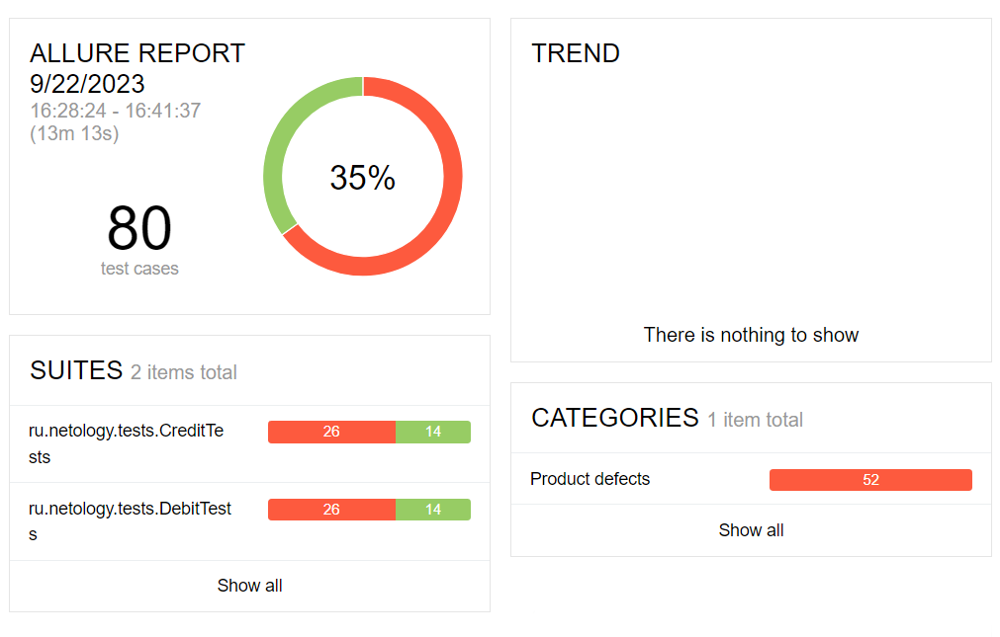

# Отчёт о проведённом тестировании
### Краткое описание
- Автоматизировано тестирование сервиса по покупке тура с возможностью оплаты 2 способами - дебетовой картой или выдачей кредита по данным карты.
### Количество тест-кейсов
Общее количество тест-кейсов - 80:
- Покупка с оплатой дебетовой картой - 40, из которых позитивных - 3, негативных - 37;
- Покупка с оплатой в кредит - 40, из которых позитивных - 3, негативных - 37.
### Процент успешных и неуспешных тест-кейсов
- Успешных тестов - 30 (37.5%);
- Неуспешных тестов - 50 (62.5%).

### Общие рекомендации
В процессе тестирования были выявлены 5 багов, на них заведены следующие [Issues](https://github.com/Bob-Jacka/Diplom/issues).
Решения о заведении багов принимались на основе логики, при этом более правильным подходом, обеспечивающим качественный результат тестирования, стало бы тестирование на основе технической документации. Например, документации, описывающей ожидаемое поведение сервиса в зависимости от статуса карты, ожидаемые виды ошибок, в т.ч. моменты появления ошибок валидации полей, правила заполнения таблиц в БД, и т.д.
